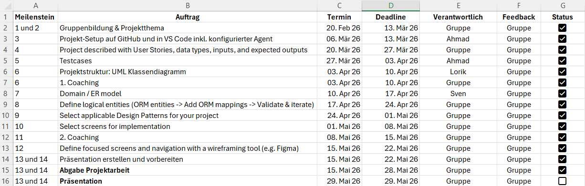
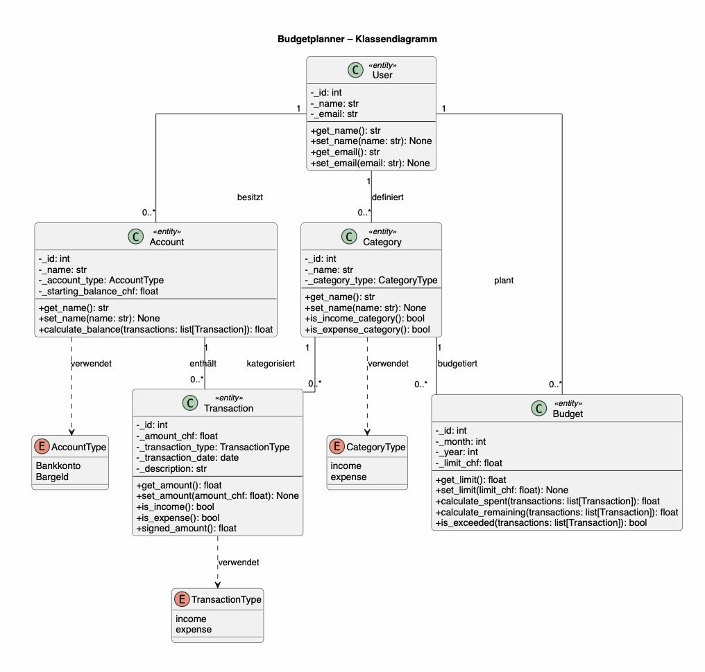
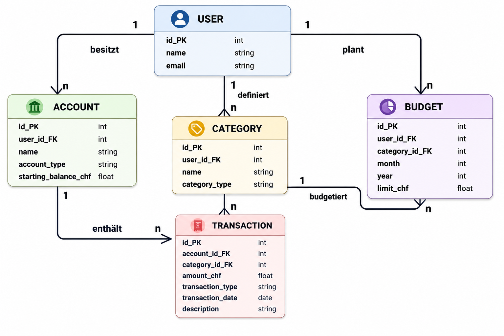
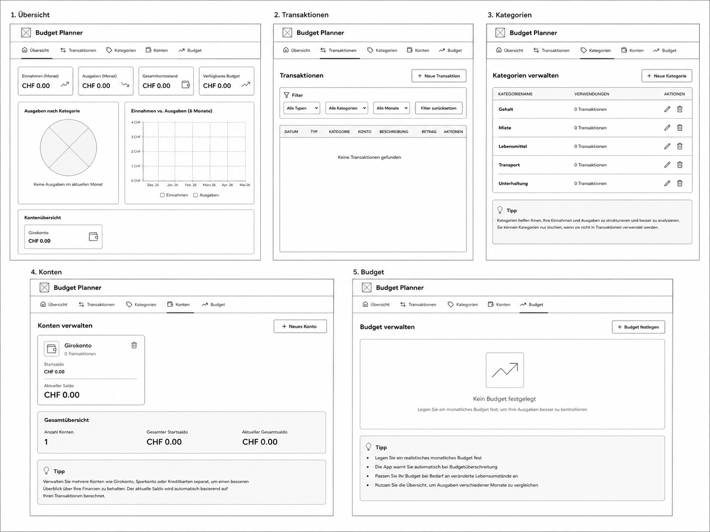
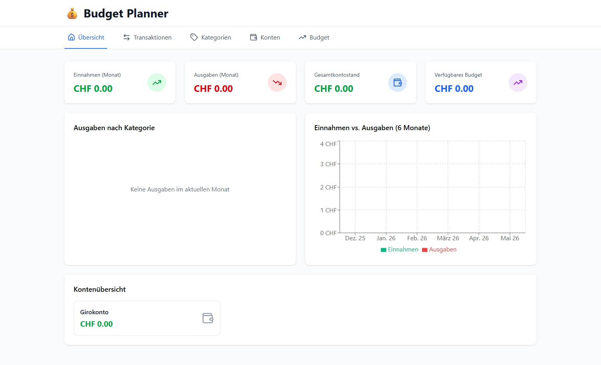
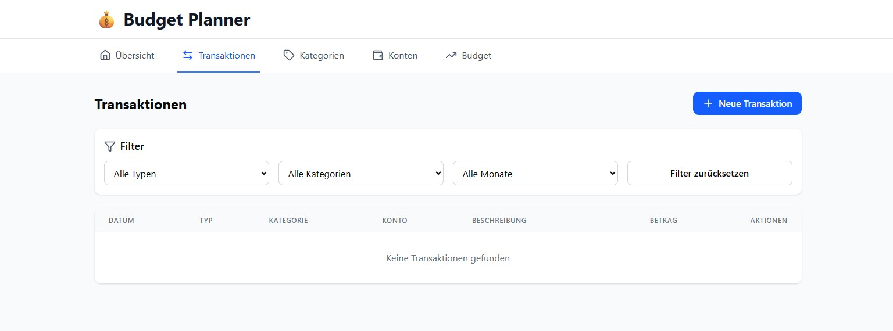
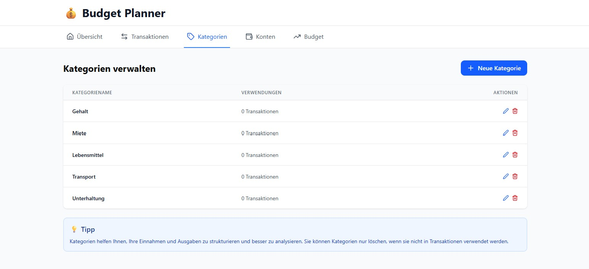
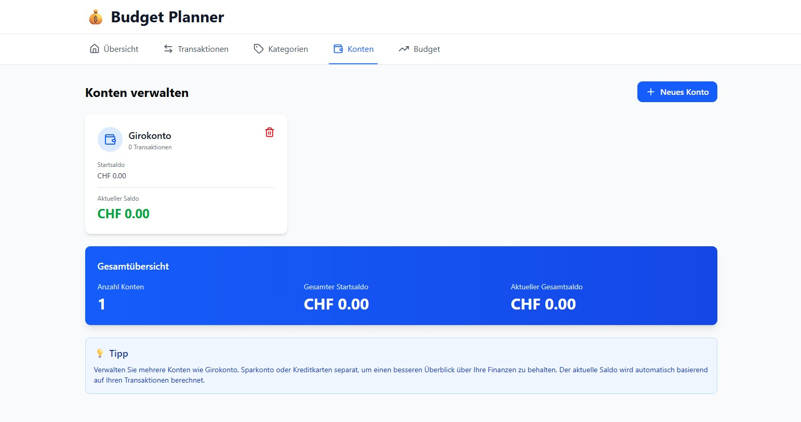
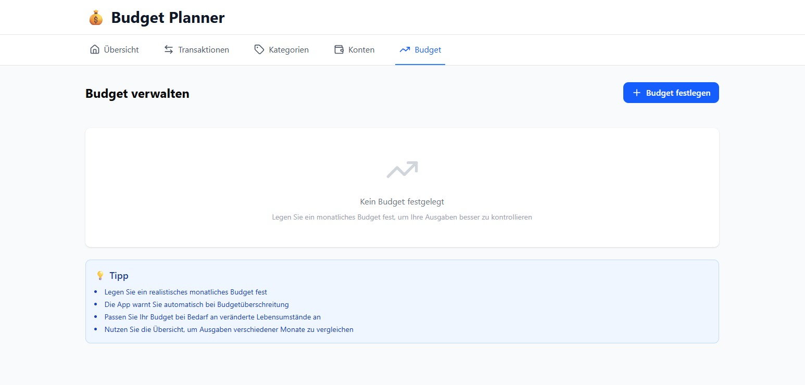

# 📊 Budgetplanner

Der Budgetplanner ist eine browserbasierte Python-Anwendung zur Verwaltung persönlicher Finanzen.  
Das Projekt orientiert sich an der Struktur des Pizzeria Reference Project aus dem Modul Objektorientierte Programmierung.

Die Anwendung hilft Benutzern dabei Einnahmen, Ausgaben, Konten, Kategorien und Monatsbudgets übersichtlich zu verwalten. Zusätzlich unterstützt sie Import, Export, wiederkehrende Transaktionen und grafische Auswertungen, damit die finanzielle Situation schnell verständlich wird.

Der Budgetplanner ist nach dem Enveloppe-System konzipiert: Für jede Ausgabenkategorie wird ein eigenes Monatsbudget festgelegt, damit jederzeit sichtbar ist, wie viel pro Kategorie noch verfügbar ist.

---

## Inhaltsverzeichnis

| Abschnitt | Inhalt |
| --- | --- |
| [Problemstellung](#problemstellung) | Ausgangslage und Motivation |
| [Lösung](#loesung) | Kurzbeschreibung der Projektlösung |
| [Projektdokumentation](#projektdokumentation) | Dokumente und direkt eingebundene Ansichten |
| ↳ [User Stories](docs/user_stories.md) | User Stories, Datentypen, Eingaben und erwartete Ausgaben |
| ↳ [Architektur-Dokumentation](docs/architecture.md) | Technische Architektur, ORM-Mapping und Validierung |
| ↳ [Test Cases](docs/testcases.md) | Manuelle Testfälle und Testübersicht |
| ↳ [Projektmanagement](#projektmanagement-ansicht) | Projektmanagement-Ansicht |
| ↳ [Klassendiagramm](#klassendiagramm-ansicht) | UML-Klassendiagramm |
| ↳ [ER-Modell](#er-modell-ansicht) | Entity-Relationship-Modell |
| ↳ [Wireframe](#wireframe-ansicht) | Wireframe der Navigation |
| ↳ [Figma-Screens](#figma-screens-ansicht) | Übersicht, Transaktionen, Kategorien, Konten und Budget |
| [Hauptfunktionen](#hauptfunktionen) | Überblick über die umgesetzten Funktionen |
| [Screens und Navigation](#screens-und-navigation) | Wireframe und Figma-Screens |
| [Architektur im README](#architektur) | Kurzbeschreibung des Schichtenmodells |
| [OOP- und Python-Konzepte](#oop-und-python-konzepte) | Eingesetzte OOP-/Python-Konzepte |
| [Design Patterns](#design-patterns) | Passende Design Patterns des Projekts |
| [UML-Diagramme](#uml-diagramme) | Kurze Einordnung von Klassendiagramm und ER-Modell |
| [Projektstruktur](#projektstruktur) | Ordner- und Dateiaufbau |
| [Installation](#installation) | Lokales Setup |
| [Start](#start) | Anwendung starten |
| [Tests](#tests) | Testausführung und Testdokumentation |
| [Autoren](#autoren) | Projektteam |
| [Lizenz](#lizenz) | Projektkontext |

---

<a id="problemstellung"></a>

## 💡 Problemstellung

Viele Personen verlieren im Alltag schnell den Überblick über ihre Finanzen:

- Einnahmen und Ausgaben werden nicht konsequent erfasst.
- Kleine Ausgaben summieren sich über den Monat.
- Budgetüberschreitungen werden oft zu spät erkannt.
- Mehrere Konten und Kategorien machen die Übersicht schwieriger.
- Wiederkehrende Zahlungen müssen oft mehrfach manuell erfasst werden.
- Daten sollen bei Bedarf importiert, exportiert oder als Bericht abgelegt werden können.

---

<a id="loesung"></a>

## ✅ Lösung

Der Budgetplanner bietet eine einfache und strukturierte Lösung:

- Einnahmen und Ausgaben zentral erfassen
- Transaktionen Kategorien und Konten zuordnen
- Finanzübersicht mit Einnahmen, Ausgaben, Saldo und Kontoständen anzeigen
- Monatsbudgets pro Ausgabenkategorie festlegen
- Budgetverbrauch, Restbudget und Überschreitungen anzeigen
- Wiederkehrende Transaktionen automatisch für mehrere Zeitpunkte erstellen
- Budgets aus dem Vormonat übernehmen
- Daten dauerhaft in einer SQLite-Datenbank speichern
- CSV-Dateien importieren und Daten als CSV oder PDF exportieren

---

<a id="projektdokumentation"></a>

## 📚 Projektdokumentation

- [User Stories, Datentypen, Eingaben und erwartete Ausgaben](docs/user_stories.md)
- [Architektur](docs/architecture.md)
- [Test Cases](docs/testcases.md)

<a id="projektmanagement-ansicht"></a>

### Projektmanagement



<a id="klassendiagramm-ansicht"></a>

### Klassendiagramm



<a id="er-modell-ansicht"></a>

### ER-Modell



<a id="wireframe-ansicht"></a>

### Wireframe



<a id="figma-screens-ansicht"></a>

### Figma-Screens











---

<a id="hauptfunktionen"></a>

## 🛠 Hauptfunktionen

- Konten erfassen, bearbeiten und löschen
- Kategorien für Einnahmen und Ausgaben verwalten
- Einnahmen und Ausgaben erfassen, bearbeiten und löschen
- Wiederkehrende Transaktionen wöchentlich, monatlich, quartalsweise oder jährlich erstellen
- Finanzübersicht mit Einnahmen, Ausgaben und Saldo anzeigen
- Kontostände aus Startsaldo und Transaktionen berechnen
- Monatsbudgets pro Ausgabenkategorie erfassen, bearbeiten und löschen
- Budgets aus dem Vormonat übernehmen
- Budgetverbrauch, Restbudget und Überschreitungen anzeigen
- Transaktionen nach Typ, Kategorie und Monat filtern
- Diagramme für Ausgaben nach Kategorie, Monatsvergleich und Ausgabenverlauf anzeigen
- CSV-Import für Konten, Kategorien, Budgets und Transaktionen
- CSV-Export einzelner oder mehrerer Bereiche
- PDF-Export als strukturierter Monatsbericht
- Darkmode und Hilfe-Dialog in der Oberfläche
- Speicherung in SQLite über SQLModel ORM

---

<a id="screens-und-navigation"></a>

## 🖼 Screens und Navigation

Für die Umsetzung wurden die fokussierten Screens [Übersicht](docs/figma_1_home.png), [Transaktionen](docs/figma_2_transaktion.png), [Kategorien](docs/figma_3_kategorien.png), [Konten](docs/figma_4_konten.png) und [Budget](docs/figma_5_budget.png) ausgewählt. Das [Wireframe](docs/wireframe.png) zeigt die grobe Navigation und Struktur der Anwendung. Die finalen Screens wurden in Figma erstellt und bilden die wichtigsten Benutzerabläufe des Budgetplanners ab.

---

<a id="architektur"></a>

## 🧱 Architektur

Die Anwendung verwendet eine Schichtenarchitektur wie im Pizzeria-Projekt. Die UI ruft Controller auf, Controller arbeiten mit Services, Services greifen über DAOs auf SQLModel/SQLite zu.

```text
NiceGUI Pages -> Controller -> Services -> DAO -> SQLModel/SQLite
```

Die detaillierten Verantwortlichkeiten, ORM-Mappings und Modellentscheidungen sind in der [Architekturdokumentation](docs/architecture.md) beschrieben.

---

<a id="oop-und-python-konzepte"></a>

## 🧩 OOP- und Python-Konzepte

| Konzept | Umsetzung |
| --- | --- |
| Klassen und Objekte | `User`, `Account`, `Category`, `Transaction`, `Budget` |
| Kapselung | Datenbankzugriff nur über DAOs, Regeln in Services |
| Single Responsibility Principle | Jede Schicht hat eine klare Aufgabe |
| ORM | SQLModel-Modelle mit Foreign Keys und Relationships |
| Testing | Automatisierte Tests und dokumentierte manuelle Test Cases |

---

<a id="design-patterns"></a>

## 🧠 Design Patterns

Wir haben für unser Projekt `Strategy`, `Facade`, `DAO` und eine MVC-ähnliche Schichtenarchitektur gewählt. `Strategy` verwenden wir für wiederkehrende Transaktionen, `Facade` für die Datenbank-Kapselung, `DAO` für Datenbankzugriffe und MVC, um UI, Controller, Services und Datenmodell sauber zu trennen. Diese Patterns wurden gewählt, weil sie die Wartbarkeit verbessern, ohne das Projekt unnötig komplex zu machen.

---

<a id="uml-diagramme"></a>

## 🗃 UML-Diagramme

Das Datenmodell besteht aus `User`, `Account`, `Category`, `Transaction` und `Budget`. Einnahmen und Ausgaben werden nicht als separate Unterklassen modelliert, sondern über `transaction_type` (`income` oder `expense`) unterschieden. Die vollständigen Datentypen, Beziehungen und ORM-Mappings stehen in [User Stories](docs/user_stories.md) und [Architektur](docs/architecture.md).

---

<a id="projektstruktur"></a>

## 📁 Projektstruktur

```text
.
|-- README.md
|-- app.py
|-- pyproject.toml
|-- pytest.ini
|-- requirements.txt
|-- budget_app/
|   |-- __main__.py
|   |-- __init__.py
|   |-- application.py
|   |-- data_access/
|   |   |-- __init__.py
|   |   |-- dao.py
|   |   |-- db.py
|   |   `-- seed.py
|   |-- domain/
|   |   |-- __init__.py
|   |   `-- models.py
|   |-- services/
|   |   |-- __init__.py
|   |   |-- account_service.py
|   |   |-- budget_service.py
|   |   |-- category_service.py
|   |   |-- finance_service.py
|   |   |-- pdf_export_service.py
|   |   |-- recurrence_service.py
|   |   `-- transaction_service.py
|   |-- ui/
|   |   |-- __init__.py
|   |   |-- controllers.py
|   |   |-- components/
|   |   |   |-- __init__.py
|   |   |   |-- cards.py
|   |   |   |-- forms.py
|   |   |   |-- layout.py
|   |   |   |-- tables.py
|   |   |   `-- theme.py
|   |   `-- pages/
|   |       |-- __init__.py
|   |       |-- accounts_page.py
|   |       |-- budget_page.py
|   |       |-- categories_page.py
|   |       |-- overview_page.py
|   |       |-- shared.py
|   |       `-- transactions_page.py
|   `-- utils/
|       |-- __init__.py
|       |-- date_utils.py
|       `-- format_utils.py
|-- docs/
|   |-- architecture.md
|   |-- er_modell.png
|   |-- figma_1_home.png
|   |-- figma_2_transaktion.png
|   |-- figma_3_kategorien.png
|   |-- figma_4_konten.png
|   |-- figma_5_budget.png
|   |-- klassendiagramm.png
|   |-- projektmanagement.png
|   |-- testcases.md
|   |-- user_stories.md
|   `-- wireframe.png
`-- tests/
    |-- conftest.py
    |-- test_db.py
    |-- test_export.py
    |-- test_import.py
    |-- test_integration.py
    |-- test_unit.py
    `-- test_validation.py
```

---

<a id="installation"></a>

## ⚙️ Installation

```bash
python -m venv .venv
```

Windows:

```powershell
.\.venv\Scripts\Activate.ps1
pip install -r requirements.txt
```

macOS / Linux:

```bash
source .venv/bin/activate
pip install -r requirements.txt
```

---

<a id="start"></a>

## ▶️ Start

Die App kann über den Kompatibilitäts-Startpunkt gestartet werden:

```bash
python app.py
```

Alternativ kann das Paket direkt gestartet werden:

```bash
python -m budget_app
```

Danach ist die App standardmässig unter folgender Adresse erreichbar:

```text
http://localhost:8080
```

Wenn Port `8080` bereits belegt ist, sucht die Anwendung automatisch den nächsten freien Port.

---

<a id="tests"></a>

## 🧪 Tests

Die Tests können mit folgendem Befehl ausgeführt werden:

```bash
pytest
```

Die Tests prüfen unter anderem:

- Finanz-, Konto- und Budgetberechnungen
- vollständige App-Workflows mit SQLite
- Validierung, Import und Export
- wiederkehrende Transaktionen

Die vollständige Testfallübersicht mit anklickbarem Inhaltsverzeichnis befindet sich in [docs/testcases.md](docs/testcases.md).

---

<a id="autoren"></a>

## 👥 Autoren

- Sven Birrer
- Lorik Kele
- Ahmad Barkat

---

<a id="lizenz"></a>

## 📜 Lizenz

Dieses Projekt wird im Rahmen eines Schulprojekts im Modul Objektorientierte Programmierung erstellt.

---

## 💸 Viel Erfolg beim Planen!
